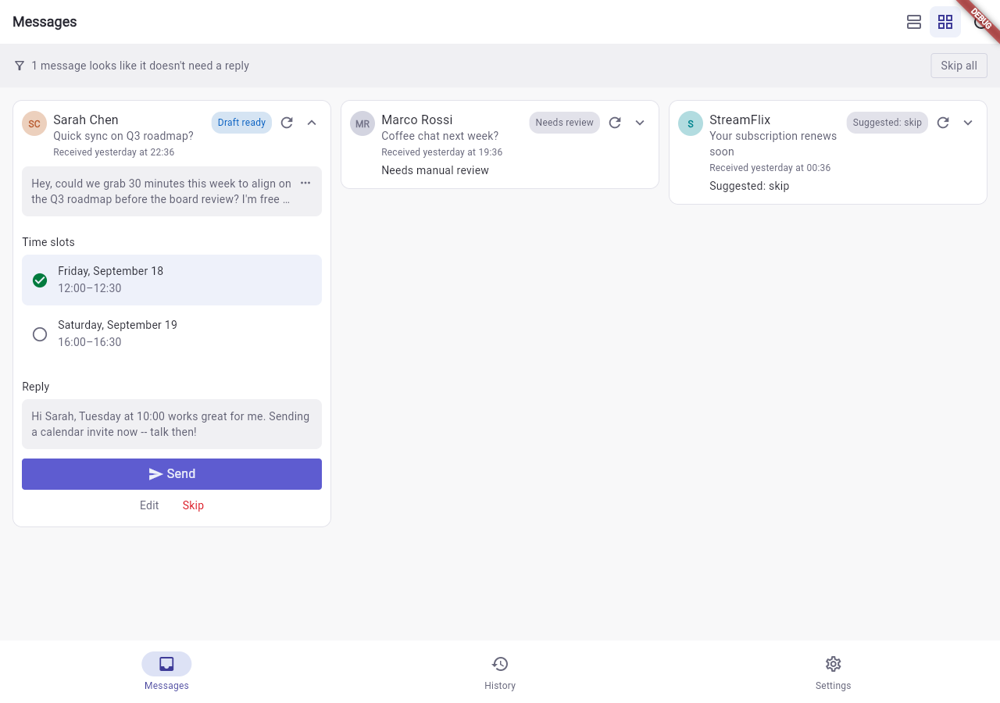
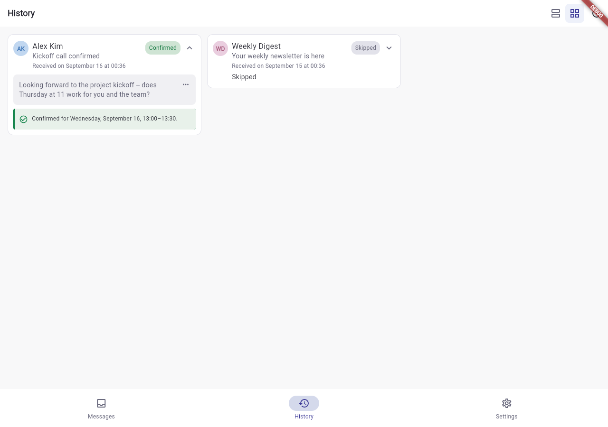
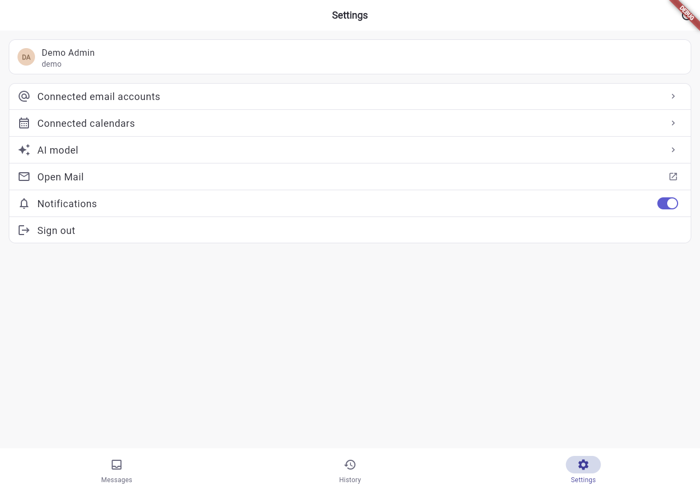
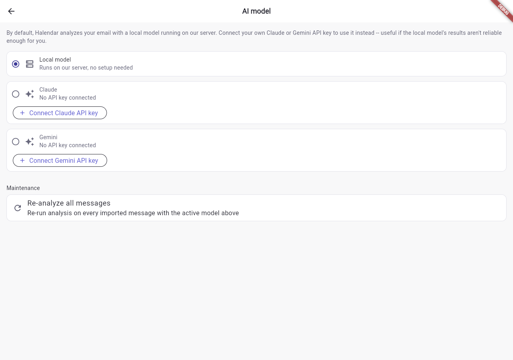
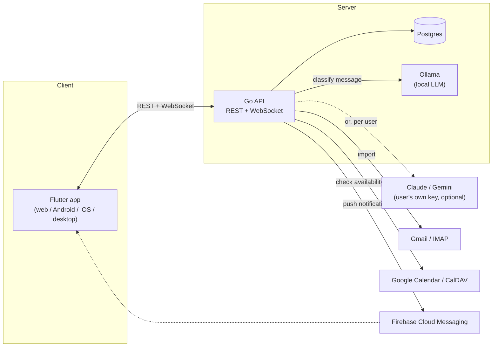

# Halendar

Halendar reads your inbox for meeting requests, checks them against your calendar,
drafts a reply, and lets you confirm or skip each one from a simple three-tab app.
It runs as your own self-hosted instance: a Go API, a Postgres database, a local
Ollama model for classification (or your own Claude/Gemini key), and a Flutter app
(web, Android, iOS, desktop).

|  |  |
|---|---|
|  |  |
|  |  |

## What it does

- **Imports mail** from a connected Gmail account (OAuth) or any IMAP/SMTP mailbox.
- **Classifies each message** with a local LLM (Ollama, on your own server -- no
  data leaves it) or, per-user, a connected Claude/Gemini API key: is this a
  genuine meeting request, and if so, what times is the sender proposing?
- **Checks those times against your calendar** (Google Calendar or any CalDAV
  server -- e.g. iCloud) and drafts a reply, free times pre-selected.
- **Messages tab**: review, edit, confirm (sends the reply and books the event),
  or skip each proposal. **History tab**: everything already confirmed or
  skipped. **Settings**: connected accounts, AI model choice, notifications.
- **Push notifications** (Firebase) when a new proposal comes in.

## Quick start

Prerequisites: [Docker](https://docs.docker.com/get-docker/),
[Go](https://go.dev/doc/install) 1.26+, [Flutter](https://docs.flutter.dev/get-started/install),
and the [`migrate`](https://github.com/golang-migrate/migrate/tree/master/cmd/migrate#installation)
CLI.

```bash
git clone <this repo> && cd halendar
make setup              # interactive config, then brings up Postgres/Ollama and migrates
make bootstrap-admin    # create your first login (there's no self-serve signup yet)

cd backend && go run ./cmd/api     # starts the API on :4355
cd ../frontend && make test        # runs the Flutter app in Chrome on :9090
```

`make setup` walks you through every config value it needs and explains where to
get it (Gmail app passwords, Google OAuth client, Firebase service account,
etc.) -- anything you skip just disables that one feature cleanly, nothing
fails to start. See [backend/README.md](backend/README.md) and
[frontend/README.md](frontend/README.md) for the full reference and everything
below in more depth.

Deploying to your own server later is a separate, optional step:
`make setup-deploy` (re-runnable any time).

## Architecture



- **`backend/`** -- the Go API (`cmd/api`), a `cmd/bootstrap` CLI for creating
  the first user, background jobs (periodic mail sync, AI classification),
  and everything needed to deploy it (`remote/`, `docker-compose.yml`).
  Details: [backend/README.md](backend/README.md).
- **`frontend/`** -- the Flutter app. Details: [frontend/README.md](frontend/README.md).
- **`halendar/`** -- a small standalone Go module (`halendar/mail`,
  `halendar/calendar`) the backend depends on locally via a `replace` directive
  in `backend/go.mod`. IMAP/SMTP and CalDAV/iCal handling live here, kept
  separate from the API so they're usable (and testable) on their own.
- **`frontend_build/`** -- gitignored. The *original* maintainer's
  `make -C frontend deploy` builds the Flutter web app here and pushes it to a
  separate repo used as a static hosting source. If you deploy your own
  instance, point this step at your own static host instead (Netlify, Pages,
  your own Caddy/nginx, ...) -- see [frontend/README.md](frontend/README.md#deploying).
- **`wireframes/`** -- early design references.

## Developing further / CI-CD

There's no CI pipeline (e.g. GitHub Actions) configured yet -- see
[Ideas for what's next](#ideas-for-whats-next). Testing today is local:
`make -C backend audit` (format, vet, `go test -race ./...`) and standard
Flutter testing under `frontend/test/`.

Deployment is a manual, `Makefile`-driven pipeline to a self-managed VPS,
already fully scripted:

1. **Provision a fresh Ubuntu server** once, with `make setup-deploy` (creates
   `backend/remote/production/Caddyfile` and `api.service` for your domain),
   then `make -C backend deploy/setup` -- runs
   [`backend/remote/setup/01.sh`](backend/remote/setup/01.sh), which installs
   Docker, Caddy, the `migrate` CLI, and a firewall, and creates a
   non-root deploy user.
2. **Deploy** with `make deploy` (or `make -C backend deploy` /
   `make -C frontend deploy` separately) -- applies pending migrations,
   syncs the Caddy config and reloads it, rebuilds the API's Docker
   container, and (frontend) builds the Flutter web app and pushes it to
   its static-hosting repo.
3. `make -C backend db/backup` / `db/import` round-trip a production
   database dump to/from your local Postgres for debugging with real(ish)
   data.

There's a Postman collection at
[`backend/docs/postman_collection.json`](backend/docs/postman_collection.json)
covering every endpoint, useful for exploring the API directly.

## Ideas for what's next

Gaps and opportunities found while streamlining setup for this README:

- **Self-serve signup/invite flow.** Today the only way to create a user is
  an existing admin (`POST /v1/users`, admin-gated) or the new
  `cmd/bootstrap` CLI. An invite-link or open-signup-with-approval flow would
  remove the need for CLI access entirely.
- **Automated CI.** No GitHub Actions (or similar) yet -- `go vet`/`go test`
  and `flutter analyze`/`flutter test` on every PR would catch regressions
  before they reach `main`.
- **iOS push notifications.** `PushNotificationsService` in the frontend is
  explicitly Android-only today (`frontend/lib/services/push_notifications.dart`);
  Firebase Core is already a dependency, so wiring up APNs is mostly frontend
  + Firebase Console config.
- **More mail/calendar providers.** Gmail + generic IMAP for mail, Google
  Calendar + CalDAV for calendars -- Outlook/Microsoft 365 is a natural next
  provider for both.
- **i18n.** `flutter_localizations` is already a dependency but nothing uses
  it yet -- the whole app is English-only.
- **Admin/user management UI polish.** `frontend/lib/pages/settings/users.dart`
  covers the basics (list, activate, change access level); bulk actions and
  an invite flow (see above) would round it out.

## License

[GNU General Public License v3.0](LICENSE).
