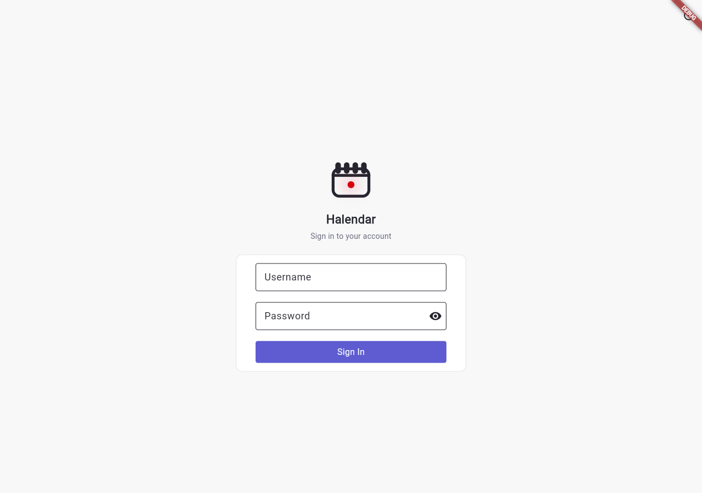

# Halendar frontend

A Flutter app (web, Android, iOS, desktop) for the three-tab flow described in
the [root README](../README.md): **Messages** (pending proposals), **History**
(confirmed/skipped), **Settings**.

| | |
|---|---|
|  |  |

## Stack

- **Flutter**, state via [`provider`](https://pub.dev/packages/provider)
  (`lib/state/`).
- [`hive_flutter`](https://pub.dev/packages/hive_flutter) for local storage
  (auth token, cached preferences).
- **`packages/lasuite_ui`** -- a local Flutter package implementing the
  [La Suite numérique](https://github.com/suitenumerique/ui-kit) design
  system as native Flutter widgets (not a port of the upstream
  React/TypeScript). See its own [README](packages/lasuite_ui/README.md).
- **`firebase_core` + `firebase_messaging`** for push notifications --
  Android-only today (`lib/services/push_notifications.dart`; see
  [Ideas for what's next](../README.md#ideas-for-whats-next) in the root
  README).

## Directory structure

```
lib/pages/       One file/folder per screen. settings/ holds the Settings sub-screens
                 (connected accounts, AI model, CalDAV connect, user management, ...).
lib/widgets/     Reusable pieces (proposal_card, time_slot_tile, empty_state, ...).
lib/state/       ProposalsStore (Messages/History data + actions), ThemeController.
lib/services/    api.dart (HTTP client), auth.dart, notifications.dart, push_notifications.dart.
lib/models/      Plain Dart models matching the backend's JSON shapes.
lib/components/  Low-level shared widgets (buttons, containers, form fields).
lib/env.dart     Backend/frontend URLs for debug vs. release builds -- gitignored,
                 generated by `make setup` (see below).
lib/const.dart   Small app-wide constants and helpers.
```

## Running locally

From the repo root, `make setup` generates `frontend/lib/env.dart` (prompting
for the backend URL) alongside the backend config, and runs `flutter pub get`.
Then, from `frontend/`:

```bash
make test    # flutter run -d chrome --profile --web-port 9090
```

(Despite the name, this isn't the test suite -- it's the existing shorthand
for running the app in Chrome; see Testing below for that.) The backend must
already be running and its `TRUSTED_ORIGINS`/`FRONTEND_URL` must include
`http://localhost:9090` for CORS -- `make setup`'s defaults already line up.

For Android/iOS: open the project in Android Studio / Xcode, or
`flutter run -d <device>` with a connected device/emulator. Android push
notifications additionally need `android/app/google-services.json`
(`make setup` offers to copy one in if you have it).

## `env.dart` / `const.dart`

`env.dart` picks between debug and release URLs via `kDebugMode`:

```dart
String backendURL = kDebugMode? "localhost:4355" : "your-production-backend";
String frontendURL = kDebugMode? "localhost:9090" : "your-production-frontend";
```

Update the release-mode values before shipping a build for your own domain.
`const.dart` holds small shared constants (e.g. the "unknown user" fallback)
and helpers used across screens.

## Testing

```bash
flutter test
```

`frontend/test/` currently has one script-style test
(`tmp_generate_icons_test.dart`). `flutter analyze` runs the lints configured
in `analysis_options.yaml`. Neither is wired into a CI pipeline yet.

## Building & deploying

```bash
flutter build web                 # -> build/web/
make deploy                       # builds web, syncs to ../frontend_build/, commits + pushes
make deploy version=X.X.X         # also records the new version in the backend's app_version table
make deploy/android                # builds and names a release APK
```

`make deploy` targets the *original* maintainer's static-hosting repo
(`../frontend_build`, gitignored, see the root README) -- if you're running
your own instance, point this at your own static host instead, or just run
`flutter build web` and deploy `build/web/` however you prefer (Netlify,
Pages, your own Caddy/nginx alongside the backend, ...).
